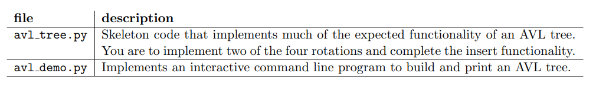

# Transform-and-conquer-AVL-Trees

Contains the skeleton code to implement an AVL Tree.\

AVL Trees are self-balancing binary search trees. Upon insertion or deletion, and AVL Tree
automatically adjusts its structure using rotations after an insertion or deletion such that
the balance factor (defined as the difference in height between the left sub-tree of a node and
the right-subtree of a node) is always {-1, 0, 1}.

In lectures, we have studied AVL trees and how to do insertion and rotations to maintain the balance
of the tree. To help you gain a greater understanding, in this laboratory exercise, you will implement
two of these rotations to rebalance the tree, then test your implementation on sample input to convince
yourselves that the rotations do maintain tree balance.

## Learning Objectives

After completing the tasks, you should know the follinwg:

- Improve their understanding of rotations and rebalancing in AVL trees.

## Information about the code

Similar to the previous laboratory on BST, avl demo.py is an interactive command line program that
can execute commands to build and print an AVL tree. The following files are provided:



The provided skeleton code allows you to dynamically modify the AVL tree using a interactive command
shell. The following commands are available:

- ```insert <element>``` - if element is not a duplicate, then creates a node containing the element and
insert into the tree. This may cause the tree to rebalance.
- ```height``` - – prints out the height of the tree.
- ```• print ascii``` - prints out tree in ascii.
- ```quit/end``` - terminates the program.

As an example, here is a sample output from typing in the insert, print ascii and height commands:
```
> python3 avl demo.py
> insert 10
> insert 4
> insert 3
> insert 15
> insert 12
> insert 20
> insert 7
> insert 8
> insert 14
> insert 11
> print_ascii

           12
          / \
         /   \
        /     \
       /       \
      8        15
     / \       / \
    /   \     /   \
   4    10   14   20
  / \     \
 3   7     11

> height

Height=3

> end
```
# Task
In avl_demo.py, we have implemented two rotations, left (method ```left_rotation()```) and right-left
(method ```right_left_rotation()``` rotations and when they are used (method ```insert()```). Study these,
and use them to help you implement the remaining two rotations, in addition to completing the implementation of the insert method 
to rebalance the tree when the inserted element was inserted into the left subtree.

- Right rotation (method ```right_rotation()```).
- Left-right rotation (method ```left_right_rotation()```).
- Implement the case where insert key is less than current root node’s key (see method ```insert()```).

## Testing your Code

Use the interactive shell to insert different values into an AVL tree, to convince yourself that the AVL tree
is working and help you study how it works. We have provided you with one sample test file test01.in
and the corresponding expected output test01.exp to test your program.

First run your program reading the inputs from stdin and write the output to file using the following
command:

```python3 avl_demo.py < test01.in > test01.out```

Then compare your output to the expected output:

```diff test01.exp test01.out```
