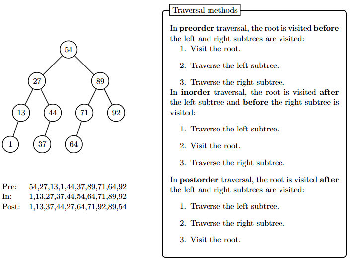
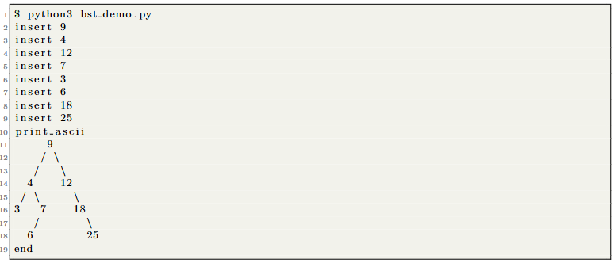

# Binary-Search-Tree

Contains the skeleton code to implement BST.

A binary search tree (bst) is a data structure that facilitates search using a binary tree to store data. A
search for an element X in a bst is successful if there exists a node in the binary tree corresponding to
the value X. Values in a bst are stored to satisfy the following property: Each internal node x stores an
element such that the elements stored in the left subtree of x are less than x and elements stored in the
right subtree of x are greater than x. This is the called *binary search tree property*.

## Learning Objectives

After completing the tasks, you should know the following:

- Learn to implement a basic BFS.
- Learn to traverse BSTs, insert elements, and print nodes in pre/post order.
- Learn to search for the min/max value of BST.
- Learn to calculate the height of a BST

### Traversal

Tree-traversal refers to the process of recursively visiting (examining and/or updating) each node in a tree
data structure, exactly once, in a systematic way. Such traversals are classified by the order in which the
nodes are visited. Starting at the root of a binary tree, there are three main steps that can be performed
and the order in which they are performed defines the traversal type. These steps are: performing an
action on the current node (referred to as “visiting” the node), traversing to the left child node, and
traversing to the right child node. Although we didn’t go through this in lectures, it is interesting to
know about traversals. Consider the following traversal approaches and example:



## Information about the code

The provided skeleton code allows you to dynamically modify the bst using a “mini” command shell:



The provided skeleton code reads data from stdin and executes operations accordingly. Two test files
test01.in and test02.in the corresponding expected outputs test01.exp and test02.exp are provided
for you to test your program. First run your program reading the inputs from stdin and write the output to file using the following
command: 

```python3 bst demo < test01.in > test01.out```

Then compare your output to the expected output:

```diff test01.exp test01.out```

# Task

Your task in this lab is to experiment with the graph traversals and implement a number of different
operations. Join the lab’s repository in GitHub Classroom using the link shared in the Labs Material on
GitHub Classroom page of the Ed Forum.

The following methods are provided in ```bst.py```:

- ```insert()``` — insert an element into the bst.
- ```inorder()``` — traverse the bst in inorder, printing out the element of nodes as we visit them
- ```preorder()``` — traverse the bst in preorder, printing out the element of nodes as we visit them
- ```postorder()``` — traverse the bst in postorder, printing out the element of nodes as we visit them
  
You are to implement the following methods for a binary search tree in ```bst.py```:

- ```search()``` — search for an element in the bst. Hint: Use insert() as your initial guide on how to
implement search.
- ```min()``` — return the minimum element in the bst. Hint: Remember the semantics of a binary search
tree.
- ```max()``` — return the maximum element in the bst. Hint: Remember the semantics of a binary
search tree.
- ```height()``` — calculate the height of the bst. Hint: height of a node = height of parent + 1.

All recursive functions can be unwound. How would you implement an iterative tree traversal?
