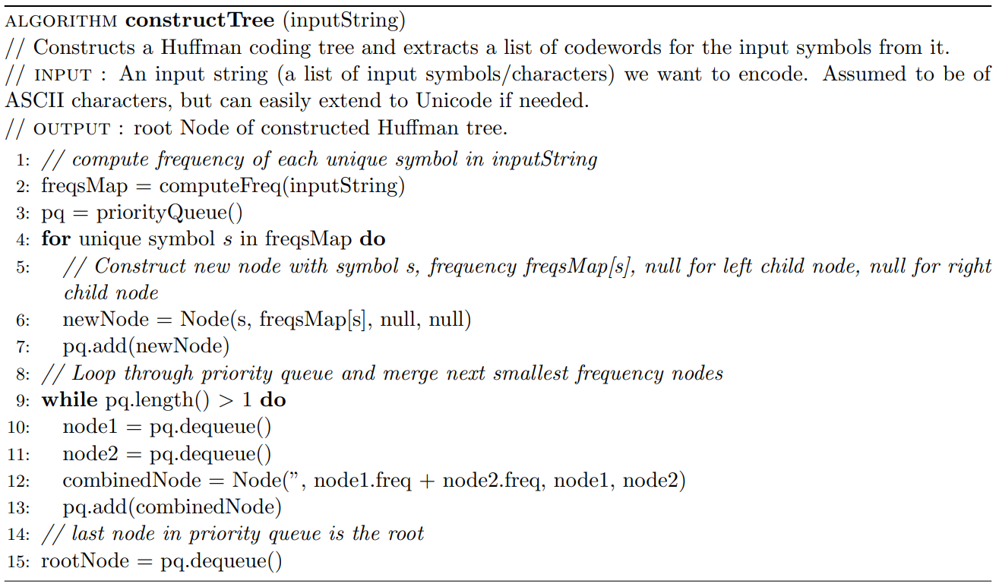
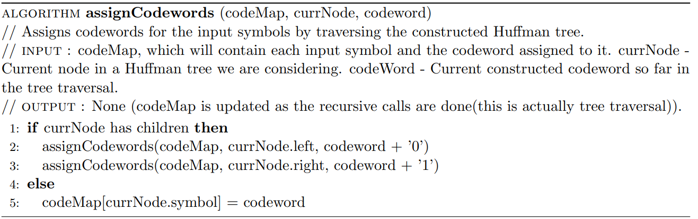
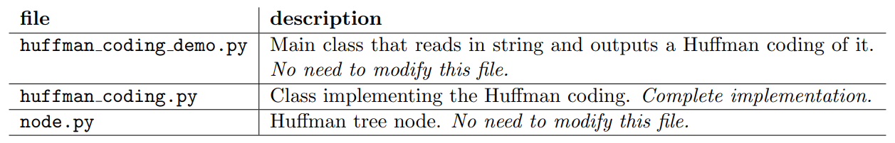

# Greedy-Algorithms

Contains the skeleton code to implement Huffman coding.

Huffman coding is an algorithm to generate prefix codes, given a string or a list of input symbols and
their frequencies/probabilities. It builds a Huffman coding tree (or just Huffman tree), which is a binary tree which has the input symbols and their frequencies as the leaves. Immediate nodes represent
combining/aggregating two children nodes together.
From the constructed Huffman tree, we can assign codewords to each of the input symbols and the set
of codewords are guaranteed to be a prefix code and of minimum length (in terms of entropy, a measure
of uncertainty and the amount of compression).
We assume we are only give a string/list of input symbols and for that case, typically an implementation
based on priority queues are the fastest. For this lab, we focus on the first case.

## Learning Objectives

After completing the tasks, you should know the following:

- Be able to implement Huffman coding.

### Pseudo-code

The pseudo code for constructing a Huffman tree is as follows. It consists of two parts, first to build
the Huffman tree, then assign codewords to each branch of the tree so that at the leaf nodes, which
contains each input symbols, we would have generated an unique codeword for it:





## Information about the code

To run the demo, run

```python3 huffman coding demo <input string>```

where ```<input string>``` is the input string of characters that we want to encode.
A sample call the program should produce the following output:

```
> python3 hufff_man_coding_demo aaabbcccccdeeeffffffff
Input String is : aaabbcccccdeeeffffffff
Applying Huffman coding , the following map is obtained:
d −> 000
b −> 001
c −> 01
e −> 100
a −> 101
f −> 11
Original string encoded with this prefix code is:
10110110100100101010101010001001001001111111111111111
```

# Tasks

The following are files provided.



Complete the implementation for the two methods in huffman coding.py:
- ```build_tree()```; and
- ```recursive_assign_codeword()```.

