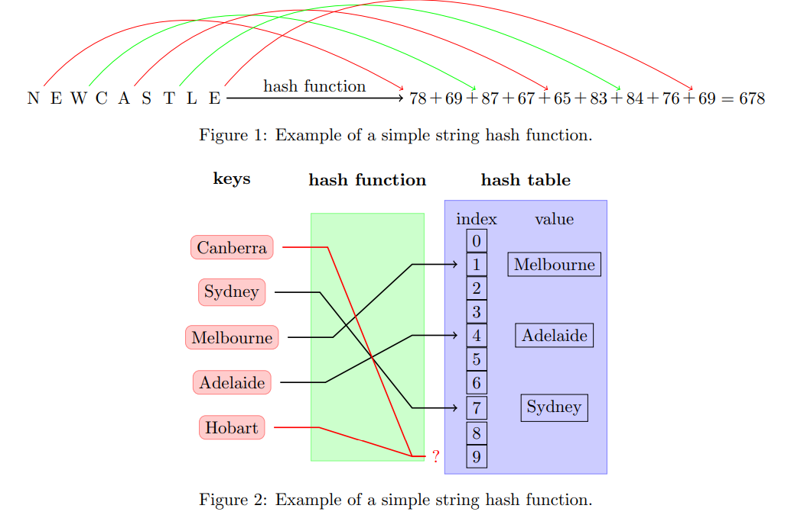
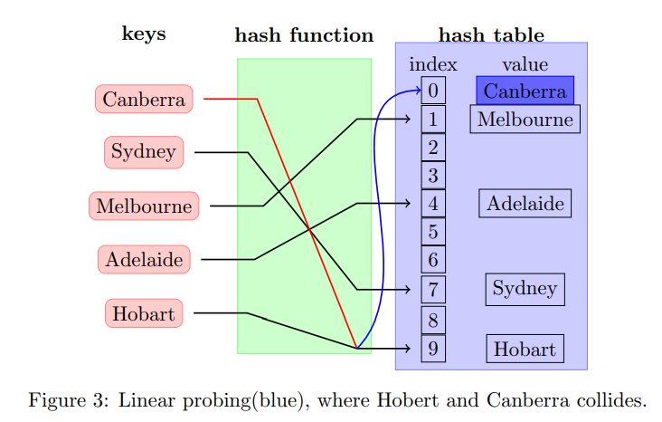
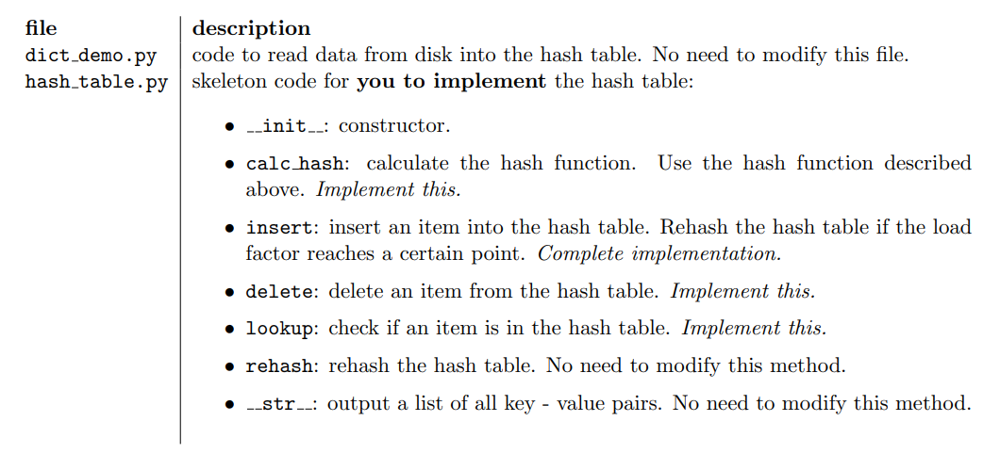
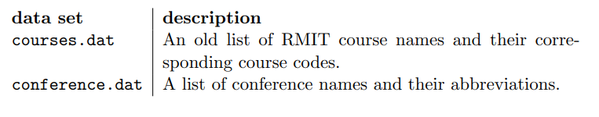
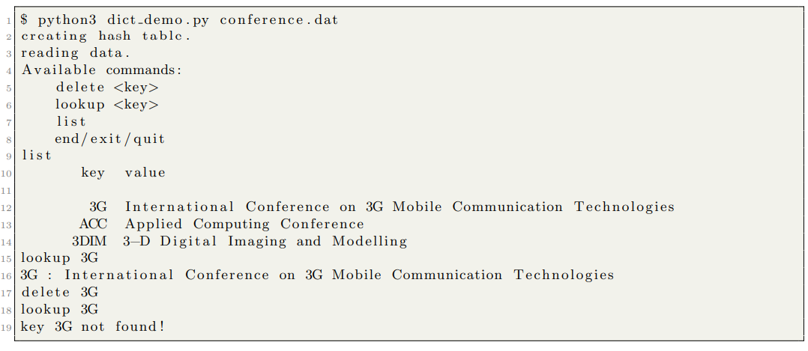

# Hash Table

Contains the skeleton code to implement a Hash Table.

## Learning Objectives

After completing the tasks, you should know the following:

- Be able to implement a simple hash table to store a dictionary.

## Dictionaries
A dictionary is a map from a set of keys to associated values. The three most common operations provided
by the dictionary ADT are:

- Search for a given item.
- Adding a new item.
- Deleting an item from the set.

A dictionary is considered static if adding and removing items is prohibited when we start performing
membership queries (search), and dynamic otherwise. Items stored in a dictionary must be uniquely
distinguishable by a key. An example of a unique key is your student ID in the RMIT university system.
In this lab exercise you will implement a dictionary ADT that stores items based on their key using a
hash table.
  

## Hash Table
### Concept

A hash table is based on the concept hashing. Hashing refers to the idea of distributing m keys within an
array H [0, ..., n − 1] of size n, the hash table. The position of a key within the hash table is determined
by computing a predefined mathematical function h(), called a *hash function*. A hash function has two
requirements:

- The hash function has to be fast to compute.
- The hash function needs to distribute the keys evenly over all the cells in the hash table. It is
important that the hash function uses the complete key (all the bits) to compute the position in
the hash table.

For this exercise we will be using a very simple hash function to compute an integer hash value from
a string: Assuming n = 13 : ```hash(NEWCASTLE) = 678mod13 = 2```.



In Figure 1, the ASCII (American Standard Code for Information Interchange)
representations of each character in the string are summed up and divided by
the size n of the hash table. The remainder of this division, which is always between 0 and n − 1, is then
used as the final hash value. The hash value, 2, would then be used to store the string “NEWCASTLE”
in cell 2 of the hash table. Consider the following example to illustrate the use of hashing to store multiple
values in a hash table.

In Figure 2, a set of strings (city names) are added to a hash table using a hash function. The hash
function processes each string and computes the hash and adds it to into the corresponding cell in the
hash table if the cell is empty. In two cases,“Canberra” and “Hobart”, the used hash function however computes the same hash, 9,
for the two distinct input keys. This phenomenon is referred to as a *collision*.

### Collisions

Collisions in hash functions have a variety of implications. Although undesirable, collisions should be
expected in the context of a hash table because the number of collisions in a hash table depends on
several factors:

- Hash table size. To map each input value to a position in the hash table, most hash functions use
the remainder of a division by the hash table size n, referred to as mod n. This will map each input
value with the same remainder to the same position in the hash table, thus creating a collision.
Smaller hash table sizes have fewer possible remainders, creating a higher probability of a collision
between two input values.
- “Quality” of the used hash function. A good hash function should be able to evenly distribute all
input values throughout the hash table. If the values computed by the hash function are clustered
in certain parts of the hash table, collisions are more likely to occur.
- The statistical properties of the input. This can cause inputs to be mapped to the same parts in
the hash table. Similar to a bad hash function, it can increase the likelihood of collision every time
a value is added to the hash table.

It is therefore essential that hash tables have a robust mechanism to deal with collisions.
We studied two ways to handle collisons, separate chaining (open hashing) and linear probing (closed
hashing). In this lab, we will concentrate on linear probing.

### Closed Hashing



Closed hashing refers to a method of resolving hash collisions within a hash table without the need for
linear lists. All keys are stored within the cells of the hash table which also implies that the size of the
hash table n has to be at least as large as the number of keys m inserted into it. There are several
strategies to resolve a hash collision using closed hashing, but in this course and lab, we focus on linear
probing:

- Linear probing. Once a collision is detected in cell k, the following cells k+1, k+2 . . . are checked.
The search operation stops once an empty cell is found. The Insert operation inserts a new item in
the next empty cell found through linear probing. Note that linear probing wraps around once the
end of the hash table is reached and continues with the first cell in the hash table.

Figure 3 shows closed hashing. After a collision is detected at cell 10 in the hash table, linear
probing(blue) are used to find the next empty cell to insert the item causing the collision in the hash
table.

### Lookup

Similar to insertion, for lookup/searching, we first hash the searched key to an index in the table. We
compare the key stored in the cell indexed, and if the same we have found the searched key. If different,
we search the next adjecent cell, until we either found the searched key or found an empty cell, meaning
the searched key is not in the table.

### Deletion

Deletion of a key is bit more tricky. Similar to insertion and search, we first search for the cell the deleted
key is stored in (or we fail to find the key and hence do not need to delete). If the cell is located, we
delete the element. If the next adjacent cell contains a key, we need to rehash it and reinsert it, as that
key could have been stored in the deleted key position. We continue this process of reinserting the next
adjacent cell until we reach an empty cell. When we do, we have updated the table for deletion.

### Rehashing

In lecture we also discussed the load factor, a parameter specifying how many keys stored vs size of the
hash table:

```load factor: α = m/n```

Both collision detection methods result in the slowdown of all dictionary operations once the load
factor reaches a certain point. A natural solution to this problem is rehashing. Rehashing a hash table
increases the size of the hash table by scanning the current table and relocating all it’s key - value pairs
into a bigger table, recalculating the hash value for each of the keys to account for the large size nnew of
the new hash table.

One way to calculate the size of the hash table is to look at the load factor desired by the new hash
table for the items currently present in the hash table:

```n_new = m_current × (1/load factor)```

## Task

In the lab exercise you are to implement a dictionary using a hash table that can store strings. You can
implement either of the two collision resolution methods described above to deal with collisions. The
following code is provided:



### Testing the code 

The following data sets are provided for you to test your implementation:



Run the command using the following parameters:



# Task

- Examine the load factor for your implementation. What can you deduct from the value?
- Can you think of other ways to hash string keys?
- Keep track of how many ”lookup operations”’ it takes for you to find a key.
  
